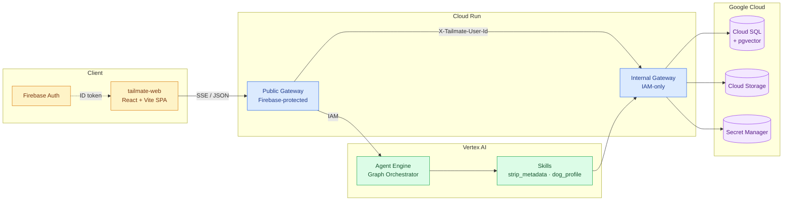

# Tailmate

> A conversational dog-care assistant built on Google Vertex AI Agent Engine,
> with a streaming web client, owner-scoped privacy controls, and a
> reviewed knowledge fallback.

Tailmate explores what it takes to build a **production-grade agentic
application** — not just a prompt and an LLM, but the full stack around it:
contract-driven architecture, multi-language fallbacks, privacy-first media
handling, owner-scoped data isolation, OpenTelemetry tracing, Prometheus
metrics, and a polished organic UI.

The chat helps a dog owner build up a profile of their dog over many short
conversations, then keeps that context available for future questions. Media
uploads (photo / video / voice note) are sanitized before storage, and every
piece of owner data is exportable and erasable on demand.

---

## Highlights

| Area                         | What's in the box                                                                                                                                                |
| ---------------------------- | ---------------------------------------------------------------------------------------------------------------------------------------------------------------- |
| **Agent runtime**            | Hexagonal architecture on Vertex AI Agent Engine with a frozen `Root Agent → Graph Orchestrator → Tools/Adapters` shape. New capabilities ship as vertical slices, not infra changes. |
| **Dog profiles**             | Profiles build themselves over multiple turns. Composite extraction strategy (Gemini Flash → Pro → deterministic rule-based) with graceful degradation per turn. |
| **Multi-language**           | Deterministic non-LLM fallback responses localized to `en-AU`, `zh-Hans`, `ar`, `vi`, `yue`, `hi` with explicit locale-resolution and reason logging.            |
| **Privacy by design**        | Photo / video / audio uploads are sanitized (EXIF, container metadata) **before** storage. Per-user GDPR-style export and hard-delete routes.                    |
| **Voice notes**              | Audio uploads route through Gemini transcription, then re-enter the standard runtime turn pipeline. No separate voice-only branch.                               |
| **Verified knowledge**       | Curated knowledge base wired in as an orchestrator port (not a skill), with semantic search and localized boundary messages for out-of-scope questions.          |
| **Streaming chat**           | `POST /v1/agent/query` supports both JSON and SSE (`text/event-stream`) from the same contract surface.                                                          |
| **Observability**            | Request-scoped structured JSON logging, W3C trace-context propagation, OpenTelemetry spans, and a Prometheus `/metrics` surface for session and skill metrics.   |
| **Rate limiting**            | Per-user sliding-window rate limit at the public ingress with a local in-memory fallback for dev.                                                                |
| **Organic design system**    | The web client implements a custom "Soft Organic" design language — parchment surfaces, forest-green ink, glass navigation, grain texture, Framer Motion.        |

## Architecture at a glance



- **`tailmate-web/`** — React 19 + TypeScript + Vite SPA. Streaming chat, dog dashboard, login, privacy controls.
- **`tailmate-db-gateway/`** — Shared Flask module deployed twice as Cloud Run services: one public Firebase-protected ingress, one IAM-only internal DB/media gateway. Same code, opposite flags.
- **`src/tailmate/`** — Python agent runtime: contracts, adapters, skills, the graph orchestrator, and the deployable agent root.
- **`tailmate-vertex-test-ui/`** — Tiny Cloud Run service for browser-based smoke testing of a deployed Agent Engine resource (no client-side credentials).
- **`deployment/agent_engine/`** — Deployment entrypoint, dependency parity script, and smoke test for the Vertex AI Agent Engine packaging.

## Tech stack

| Layer            | Tech                                                                 |
| ---------------- | -------------------------------------------------------------------- |
| Runtime          | Python 3.11, Flask, SQLAlchemy 2, Alembic                            |
| AI / ML          | Vertex AI Agent Engine, Gemini 2.5 (flash + pro), Vertex embeddings  |
| Storage          | PostgreSQL (pgvector), Google Cloud Storage                          |
| Frontend         | React 19, TypeScript, Vite, Tailwind, Framer Motion, Firebase Auth   |
| Observability    | OpenTelemetry, Prometheus, structured JSON logging                   |
| Infra            | Cloud Run, Cloud Build, Docker, Vertex AI Reasoning Engine           |
| Tooling          | `uv` (Python), `pnpm` (Node), Ruff, mypy, Bandit, pip-audit, pytest  |

## Repository layout

```
.
├── src/tailmate/                  # Agent runtime: contracts, adapters, skills, orchestrator
│   ├── agent_runtime/           # Graph orchestrator + ports
│   ├── adapters/                # GCS, DB, gateway client, dog-profile extractors, audio, KB
│   ├── skills/                  # strip_metadata, dog_profile
│   ├── contracts/               # Frozen public types and gateway path constants
│   ├── bootstrap/               # AppConfig, environment validation
│   └── entrypoints/             # local_dev, deploy, CLI
├── tailmate-web/                  # React SPA
├── tailmate-db-gateway/           # Flask gateway (dual-mode public + internal)
├── tailmate-vertex-test-ui/       # Smoke-test UI for deployed Agent Engine
├── deployment/agent_engine/     # Vertex AI packaging + smoke test
├── docs/                        # Architecture decisions, slice docs, runbooks
└── tests/                       # unit · contract · integration
```

## Engineering principles

Tailmate is built around a small set of opinions that show up everywhere in the
codebase:

1. **The framework shape is frozen; features are vertical slices.**
   `Root Agent → Graph Orchestrator → Tools/Adapters` is non-negotiable.
   New features enter through `Contract → Adapter → Skill → Orchestration`,
   not by widening infrastructure layers. See
   [`docs/repository-blueprint.md`](docs/repository-blueprint.md).

2. **Sanitize before storage.** Media privacy is a business invariant, not a
   feature flag. Raw upload bytes are never persisted. See
   [`docs/strip-metadata-slice.md`](docs/strip-metadata-slice.md).

3. **Two trust models, one codebase.** The same gateway module ships as both a
   public Firebase-protected ingress and an IAM-only internal service —
   trust is enforced at deploy time via env flags. See
   [`docs/identity-gateway-slice.md`](docs/identity-gateway-slice.md).

4. **Graceful degradation is the contract.** When Gemini is unavailable,
   the rule-based extractor takes over. When the KB misses, deterministic
   localized fallback fires. When transcription fails, the audio path still
   returns a successful sanitize response. The user always gets *something*
   coherent in their preferred locale.

5. **Every public surface has a versioned slice doc.** Each capability ships
   alongside a markdown spec covering contract, adapter boundary, and
   acceptance criteria. See `docs/*-slice.md`.

## Documentation

| Document                                                              | What it covers                                                           |
| --------------------------------------------------------------------- | ------------------------------------------------------------------------ |
| [Development Spec](docs/development-spec.md)                          | Hexagonal layering, env contract, runtime modes (`LOCAL` / `CLOUD`)      |
| [Repository Blueprint](docs/repository-blueprint.md)                  | Directory map and module ownership                                       |
| [Feature General View](docs/feature-general-view.md)                  | Plain-language product walkthrough                                       |
| [Design Spec](docs/design-spec.md)                                    | "Soft Organic" design language for the web client                        |
| [Web Frontend Slice](docs/web-frontend-slice.md)                      | React app architecture and contracts                                     |
| [Dog Profile Slice](docs/dog-profile-slice.md)                        | Composite extraction strategy + multi-dog reasoning                      |
| [Strip Metadata Slice](docs/strip-metadata-slice.md)                  | Image / video / audio sanitization                                       |
| [Identity Gateway Slice](docs/identity-gateway-slice.md)              | Dual-mode public/internal gateway                                        |
| [Privacy Compliance Slice](docs/privacy-compliance-slice.md)          | Per-user export and hard-delete                                          |
| [Observability Slice](docs/observability-slice.md)                    | Structured logs, OpenTelemetry, request-id propagation                   |
| [Business Metrics Slice](docs/business-metrics-slice.md)              | Prometheus `/metrics` surface                                            |
| [Public Rate Limit Slice](docs/public-rate-limit-slice.md)            | Per-user sliding-window rate limit                                       |
| [Knowledge Base Slice](docs/knowledge-base-slice.md)                  | Verified KB as an orchestrator port                                      |
| [How To Add A Skill](docs/how-to-add-a-skill.md)                      | The skill scaffolding lifecycle                                          |
| [ADR-0001](docs/adr-0001-reject-direct-gcs-upload-and-firestore.md)   | Reject direct-to-GCS uploads and Firestore migration                     |
| [ADR-0002](docs/adr-0002-public-api-versioning-strategy.md)           | Public API versioning strategy                                           |
| [ADR-0003](docs/adr-0003-hard-delete-user-privacy-requests.md)        | Hard-delete strategy for user privacy requests                           |

## Local development

```bash
# 1. Configure Google Cloud
gcloud auth application-default login
gcloud config set project <your-project-id>

# 2. Set up the Python env
cp .env.example .env   # fill in TAILMATE_* values
uv sync

# 3. Start the local Cloud SQL Auth Proxy
./scripts/start_cloudsql_proxy.sh

# 4. Try the developer CLI
uv run tailmate local-demo --message "My dog Mochi is a 3-year-old French Bulldog."

# 5. Or run the interactive REPL
uv run tailmate local-chat --session-id chat-1 --user-id <bound-user-id>
```

For the web client:

```bash
cd tailmate-web
pnpm install
pnpm dev
```

The local entrypoint forces `TAILMATE_ENV=LOCAL`, loads `.env`, checks tunnel
reachability, and validates ADC only when the configured extraction strategy
actually needs live Gemini access — so `rule` and `composite` strategies can
run fully offline.

## Quality gates

```bash
uv run python -m compileall src
uv run python -m pytest tests/unit
uv run python -m pytest --no-cov tests/contract
```

CI runs Ruff, scoped mypy, Bandit, pip-audit against locked runtime deps,
unit tests with a **70% coverage floor** for `src/tailmate`, and contract tests.

## Status

Tailmate is at pre-1.0 (`0.x.y`). The framework shape is stable; capability
surface is intentionally narrow — `strip_metadata` and `dog_profile` ship as
production-quality slices, with the verified KB as an orchestrator-level
fallback. The [`CHANGELOG`](CHANGELOG.md) tracks every slice and patch release.

## License

[MIT](LICENSE) © Ge LI
